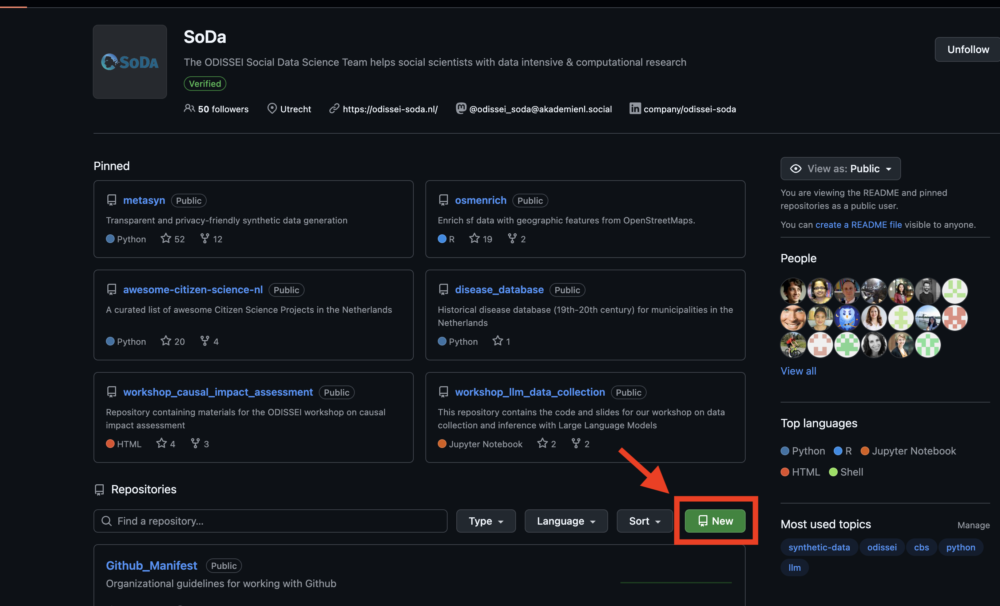
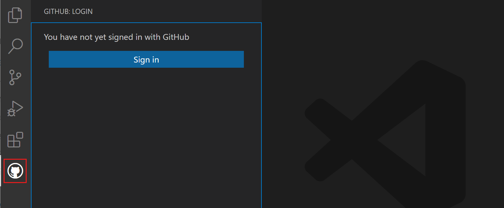
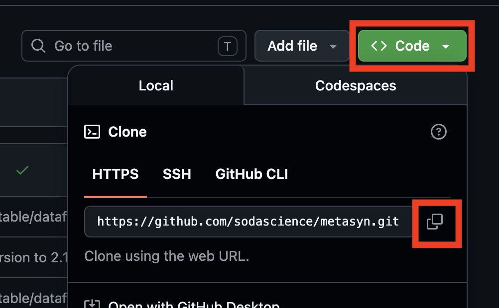
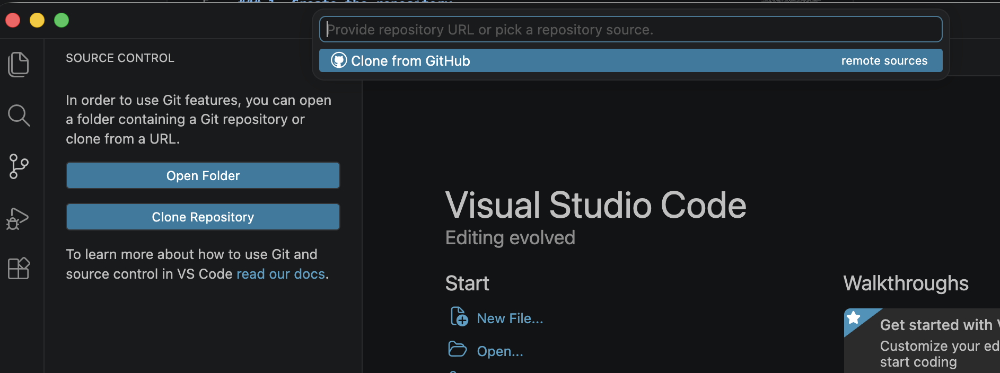

# Intructions to create a python package project with SoDa

A package is a library/tool intended to be distributed and reused by others (or your future self).

### 1. Create the repository

Go to [SoDa](https://github.com/sodascience) and create a new repository. 

- Fill in the name of the project in kebab-case (hyphens separated) and add a short description of the project
- Add a README file

### 2. Access the repository locally

There are many ways to access a repository, for example:
1. Visual Code
2. Terminal
3. AI cloud coder

We will show how you can start working on local computer via a visual editor.

> Make sure you have Visual Code or a similar IDE installed

1. Open Visual Code and connect to github

2. From the repository page copy the HTTPS URL
 
3. Open the repository in the code editor

### 3. Create the project

TODO: Make a instruction given the languange of the project and the type of the project 'package' or 'research-project'